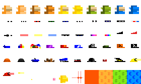

# D.I.Y. Monkes Collection Starter - More Classics, Currency (Bitcoin/Dollar/Euro), Maxi Biz Editions 


##  Wen Deploy? Wen Mint?

Here's everything to make it happen - yes, you can. 


### Step 1: Inscribe spritesheet.png (<4kb)   - DONE!

  

[inscribe №18566375](https://ordinals.com/inscription/f685f68aafb1cd897013fb736f24f247848b71f38e425930b462fda39fdca3f8i0)  by effinhot - thank you!


### Step 2:  Inscribe the collection deploy text 

Note: Fill-in the inscribe / inscription id 
for the inscribed spritesheet.png above.


```
og deploy monke
name: D.I.Y. Monke
max: 66
dim: 28x28
f685f68aafb1cd897013fb736f24f247848b71f38e425930b462fda39fdca3f8i0
```

That's it. Yes, you can - start a free mint (first-come/first-serve).

Wen [next] deploy?   You are welcome to announce your ordgen / ORC-721 collections
in the [ordgen / ORC-721](https://discord.gg/dDhvHKjm2t) discord (in the #general channel).


## Monke Mint Samples


To find your g(enerative) numbers in range 0-59 (60) for the mint text - try the [D.I.Y. Monkes Previewer »](https://orc721.github.io/monkes.starter/preview)


`monke 57 0 19 53 34`


`monke 58 7 18 41 52 53`


`monke 54 28 52 55`


`monke 54 14 52 48`


## Questions? Comments?

Join us in the [Ordgen / ORC-721 discord (chat server)](https://discord.gg/dDhvHKjm2t). Yes you can.
Your questions and commetary welcome.

Or post them over at the [Help & Support](https://github.com/geraldb/help) page. Thanks.

